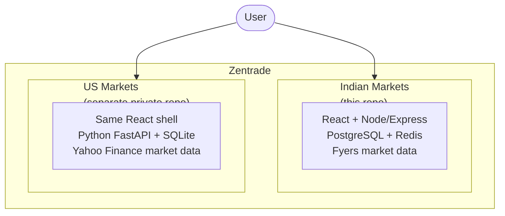
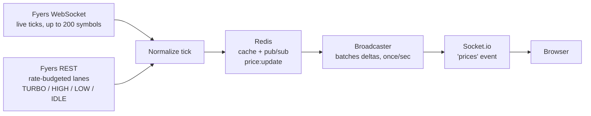
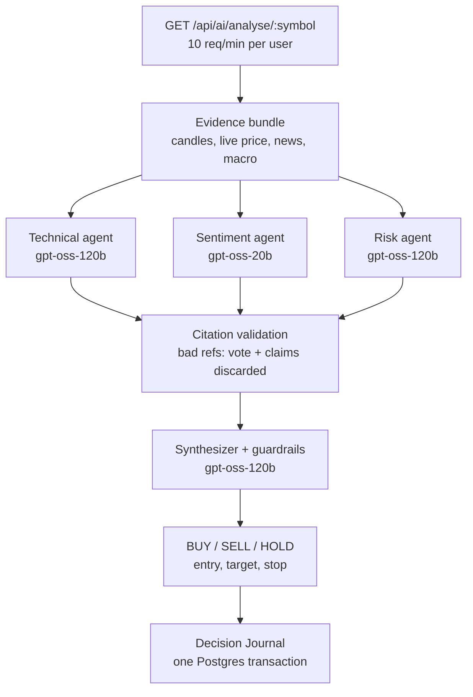
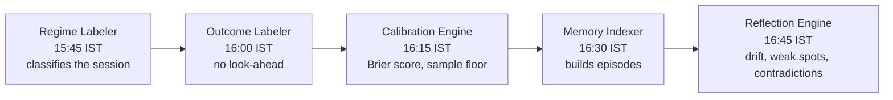
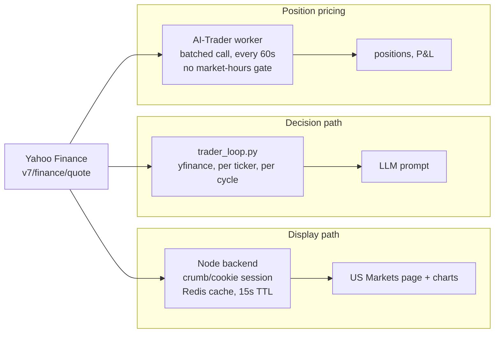
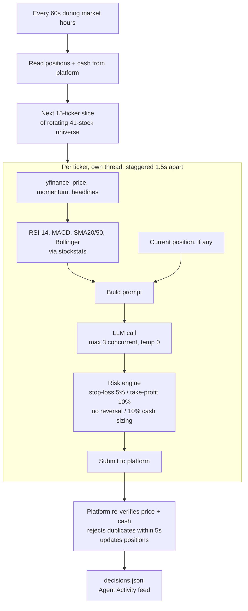

# Zentrade

Paper trading simulator for Indian and US stock markets. Real prices, virtual money. Trade Indian stocks yourself, or watch an autonomous AI agent trade US stocks on its own, without risking actual capital.

## The Problem

90% of beginner intraday traders blow up their accounts in the first few months. Not because markets are unfair, but because they go in blind. No experience with order flow, no discipline around stop-losses, no feel for how quickly things move during market hours. They learn the hard way and pay for it with real money.

---

## The Solution

Zentrade puts you in a real trading environment. Trade NSE stocks with a ₹10,00,000 virtual balance, or watch a $100,000 US paper account run entirely by an LLM-driven agent. Live prices, real PnL, no real damage done.

---

## Architecture

Zentrade is two independent trading systems sharing one product. Indian markets is the original system: a Node and Postgres monorepo with a multi-agent AI deliberation pipeline and a nightly self-grading loop. US markets is newer and simpler: live quotes plus a fully autonomous paper-trading agent, built to prove out real-time LLM trading before investing the same rigor into it.

**US markets code lives in a separate, private repository, not in this one.** `us_agent/` exists locally on the development machine but is excluded from this repo's git history on purpose, since it vendors a full self-hosted trading platform and holds real API keys in local config. A deployable copy is mirrored into its own private repo for hosting.



---

### Indian markets

#### How prices flow

Fyers is the only price source. Its WebSocket carries real-time ticks for up to 200 symbols at a time, the hard cap Fyers enforces on live streaming. For everything outside that cap, and for historical candles, a REST layer fills in, governed by a rate-budget system: a 100,000-call daily quota split into named sub-budgets, with a TURBO/HIGH/LOW/IDLE mode that retunes concurrency based on time of day and budget left. Two independent polling lanes sit on top of that, a slow lane every 5 minutes covering the full watchlist, and a depth lane every 15 seconds for top-tier symbols when budget allows. Every tick, from either channel, gets normalized, cached in Redis, and published on a `price:update` channel. One broadcaster batches whatever changed and emits it as a single Socket.io `"prices"` event to every connected browser, once a second. The browser never talks to Fyers or Redis directly.



#### How a decision gets made

Clicking Analyse on a stock, or the market-data slow lane triggering it automatically, hits `GET /api/ai/analyse/:symbol`, rate-limited to 10 calls a minute per user. The request assembles an evidence bundle (daily and intraday candles, live price, news, macro context), then runs three agents in parallel against Groq, Technical, Sentiment, and Risk, each required to cite specific evidence references for every claim. Any agent whose citations do not check out has its vote and its claims discarded from the synthesis entirely. A fourth call, the Synthesizer, makes the final BUY, SELL, or HOLD decision with entry, target, and stop, sitting on top of deterministic code guardrails that can override it, for example downgrading a non-unanimous BUY facing a macro headwind to HOLD regardless of what the model said. Every input, every agent's raw output, and the final decision get written into an append-only Decision Journal in one Postgres transaction. A journal write failing never breaks the answer the user sees.



#### Did it actually work

A five-stage chain runs every weekday evening, each stage strictly downstream of the one before it. Outcome Labeler enforces strict no-look-ahead rules, only ever reading candles that come after the decision it is grading. Calibration Engine holds back a score until a bucket has enough samples to mean anything, rather than reporting a number from three data points. None of this yet feeds back into the live decision path. It is a measurement system today, kept deliberately separate from the agents it measures.



An outcome-weighted retrieval API can already rank and return these episodes by relevance, recency, and how informative the outcome was rather than how successful it was. It exists as a callable, independent read path today, not yet wired into the agents above.

#### Tools and why

| Tool | Why |
|---|---|
| Express + raw `pg`, no ORM | Every query is hand-written SQL, matching the rest of the codebase's discipline |
| Socket.io on the same HTTP server | No separate real-time infrastructure to run |
| `ioredis` | One tool for the price cache, rate-limit counters, and session blocklist |
| `fyers-api-v3` | Official SDK for both REST and the tick WebSocket |
| `bottleneck` | Token-bucket limiting driving the TURBO/HIGH/LOW/IDLE lane system |
| `node-cron` | Runs the nightly five-stage chain, no separate job scheduler |
| Groq via raw `fetch()`, no SDK | Keeps provider-specific tuning like `reasoning_effort: "low"` under direct control |
| `lightweight-charts` | Real candlestick charting without hand-rolled canvas rendering |

---

### US markets

#### How prices flow

Three separate paths, deliberately not shared. The display path (the US Markets list and stock charts) calls Yahoo Finance directly from the existing Node backend, the same crumb and cookie session pattern already used for Indian data, cached in Redis for 15 seconds. It works whether or not the Python trading agent is running. The agent's own path pulls price, momentum, and news for each ticker itself through `yfinance`, once per ticker per cycle, purely to build its decision prompt. A third, separate call happens inside the trading platform itself: a background worker refreshes every open position's current price with one batched Yahoo call a minute, on a plain timer with no market-hours gate, which is why prices keep updating even on a market holiday.



#### How a decision gets made

Every 60 seconds during US market hours, the loop reads current cash and open positions from the trading platform, then takes the next 15-ticker slice of a rotating 41-stock universe. For each ticker, in its own thread: fetch price and momentum, compute RSI-14, MACD, price versus the 20 and 50-day SMA, and Bollinger Band position, read the current position if any, and build a plain-text prompt out of all of it. The prompt goes to an LLM through a provider-agnostic OpenAI-compatible client, capped at 3 simultaneous calls regardless of batch size, with greedy decoding so the same inputs give the same answer. The model's BUY, SELL, or HOLD comes back, and a deterministic risk engine has the final say: a stop-loss at 5% down or take-profit at 10% up forces an exit regardless of what the model said, an existing position blocks a same-direction reversal, and a fresh buy is sized at 10% of that cycle's starting cash, tracked through a shared lock so 15 threads sizing independently can never collectively overspend it. Whatever survives gets submitted to the trading platform, which re-verifies the price and cash itself before recording anything, and rejects an exact duplicate submitted again within 5 seconds. Every ticker's full trail, indicators, the model's stated reasoning, and what the risk engine did with it, gets logged once a cycle, which is what the Agent Activity page reads.



#### Tools and why

| Tool | Why |
|---|---|
| FastAPI + SQLite | Light enough for a single-agent paper account, no infrastructure to run |
| Two processes (API + worker) | HTTP requests never compete with price refresh for the database connection |
| `yfinance` | Free, keyless price and history data |
| `stockstats` | Indicator math from one dependency instead of hand-rolled technical analysis |
| Provider-agnostic OpenAI-compatible client | Switching LLM providers is a config change, not a rewrite |
| OS-level file lock (`flock`) | Guarantees only one continuous decision loop can ever run at once |

---

## Features

### Indian markets
- Google OAuth login
- Live NSE prices via Socket.io
- Intraday (MIS 5x leverage) and Delivery (CNC) order modes
- Real-time portfolio PnL
- Order history, watchlist
- AI stock analysis on demand, four agents deliberating with cited evidence
- Candlestick charts (1D to 1Y)
- Auto square-off at 15:25 IST
- PWA, installable on mobile

### US markets
- Live US stock quotes
- An autonomous paper-trading agent that decides and trades on its own every cycle
- On-demand Predict, the same agent's reasoning for any stock without it trading
- Agent Activity feed, a full audit trail of every cycle
- Deterministic risk engine on top of every LLM decision

---

## Running it

### Indian markets

Needs Node 20+, a running PostgreSQL instance, a running Redis instance, and Fyers API credentials in `apps/api`'s environment config.

```bash
npm install

npm run dev:api      # builds workspace packages, then runs apps/api with --watch
npm run dev:web      # apps/web via Vite
```

Other commands:

```bash
npm run build              # build packages + apps/web
npm run test                # run tests across workspaces
npm run lint                 # eslint
npm run check:boundaries     # enforce the pure-domain package boundaries in CI
```

### US markets

Needs Python 3 with a virtualenv at `us_agent/.venv`, and `us_agent/.env` filled in (`AGENT_TOKEN`, `OPENAI_API_KEY`, `OPENAI_API_BASE`, `OPENAI_MODEL`, `TICKERS`, and the risk parameters).

```bash
./us_agent/run_us.sh              # AI-Trader API (port 8000) + worker + Predict service (port 8001)
./us_agent/run_decision_loop.sh   # the autonomous trading loop, needs run_us.sh already running
```

Testing a single cycle without leaving anything running in the background:

```bash
python trader_loop.py --once
python trader_loop.py --once --executed-at 2026-08-20T15:30:00Z   # historical fill, bypasses the market-hours gate
```

---

## Future Scope

- Limit orders and stop-loss triggers (Indian markets)
- Portfolio analytics and daily PnL history
- Price alerts via push notifications
- Leaderboard and trading competitions
- Multi-model consensus for the Indian markets agent (Groq, Gemini, and Cerebras voting together, not a single model)
- Production hosting for the US trading agent (currently local-only)
